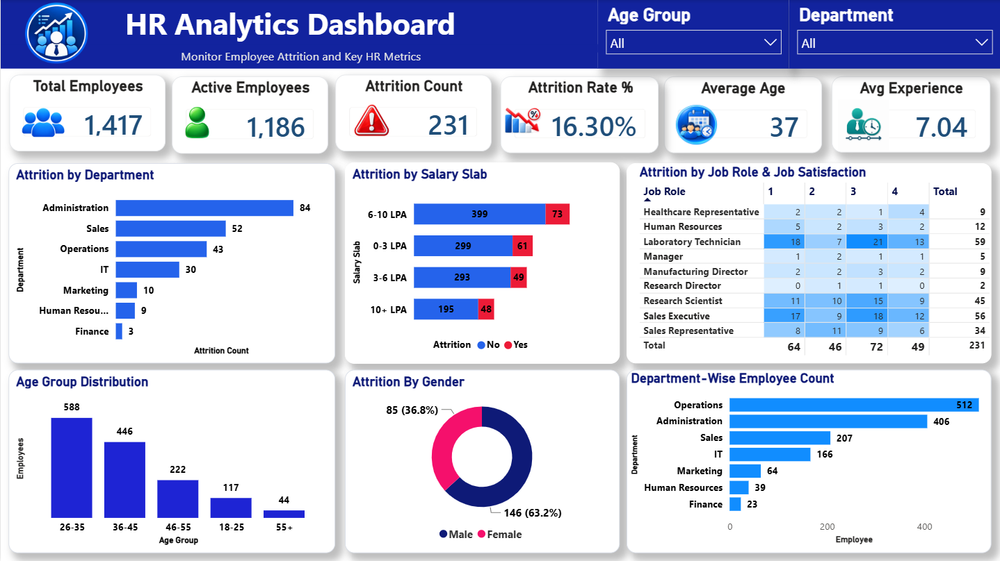

# 📊 HR Analytics Dashboard | Power BI

An interactive **HR Analytics Dashboard** developed using **Microsoft Power BI** to analyze employee attrition, workforce demographics, job roles, salary levels, job satisfaction, and department-wise employee distribution.

This project demonstrates practical skills in **data cleaning, data transformation, data visualization, DAX, and business intelligence** using Power BI.

---

## 📸 Dashboard Preview



---

## 🎯 Project Objective

The objective of this project is to transform raw HR data into an interactive dashboard that helps analyze employee attrition and workforce patterns.

The dashboard provides insights into:

- Employee attrition
- Department-wise workforce distribution
- Salary slab-wise attrition
- Age group analysis
- Gender-wise attrition
- Job role analysis
- Job satisfaction and attrition patterns

---

## 📌 Key KPIs

| KPI | Value |
|---|---:|
| 👥 Total Employees | **1,417** |
| 🟢 Active Employees | **1,186** |
| 🔴 Attrition Count | **231** |
| 📉 Attrition Rate | **16.30%** |
| 🎂 Average Age | **37** |
| 💼 Average Experience | **7.04 Years** |

---

## 📊 Dashboard Features

### Employee Attrition Analysis

- Overall employee attrition
- Department-wise attrition
- Salary slab-wise attrition
- Gender-wise attrition
- Age group-wise attrition

### Workforce Analysis

- Department-wise employee distribution
- Age group distribution
- Gender distribution
- Job role analysis

### Job Satisfaction Analysis

- Attrition by job satisfaction level
- Job role and satisfaction analysis
- Comparison of attrition across different job roles

### Interactive Filters

The dashboard includes interactive filters for:

- **Age Group**
- **Department**

These filters allow users to dynamically explore different segments of the workforce.

---

## 🧹 Data Cleaning & Transformation

The raw HR dataset was imported from **Microsoft Excel into Power BI**, where data cleaning and transformation were performed using **Power Query**.

The original Excel file was retained as the raw source dataset.

The data transformation process included:

- Promoting headers
- Changing and validating data types
- Sorting rows
- Removing unnecessary top rows
- Removing duplicate records
- Filtering rows
- Replacing values where required
- Creating a conditional `AttritionCount` column

### AttritionCount

A conditional column was created based on employee attrition status:

```text
If Attrition = "Yes" → 1
If Attrition = "No"  → 0
```

This numeric indicator supports the calculation and analysis of employee attrition within the dashboard.

For detailed transformation steps, see:

[Data Cleaning & Transformation Documentation](Documentation/Data_Cleaning_and_Transformation.md)

---

## 🛠️ Tools & Technologies

- **Microsoft Power BI**
- **Power Query**
- **DAX**
- **Microsoft Excel**

---

## 📂 Project Structure

```text
HR_Analytics_PowerBI/
│
├── Dashboard/
│   └── HR_Analytics_Dashboard.pbix
│
├── Dataset/
│   └── HR_Analytics_Raw.xlsx
│
├── Documentation/
│   └── Data_Cleaning_and_Transformation.md
│
├── Screenshots/
│   └── HR_Analytics_Dashboard.png
│
└── README.md
```

---

## 📁 Files & Folders

| File / Folder | Description |
|---|---|
| `Dashboard/` | Contains the Power BI dashboard file |
| `Dataset/` | Contains the raw HR dataset |
| `Documentation/` | Contains detailed data cleaning and transformation documentation |
| `Screenshots/` | Contains dashboard preview images |
| `README.md` | Project overview and documentation |

---

## 💡 Key Insights

The dashboard can be used to identify:

- Overall employee attrition trends
- Departments with comparatively higher attrition
- Relationship between salary levels and employee attrition
- Attrition patterns across different age groups
- Gender-wise attrition trends
- Job role and job satisfaction patterns
- Workforce distribution across departments

The interactive filters allow users to explore these insights across different workforce segments.

---

## 🚀 Skills Demonstrated

This project demonstrates practical skills in:

- Data Cleaning & Transformation
- Power Query
- Data Visualization
- Dashboard Development
- DAX & KPI Analysis
- HR Analytics
- Business Intelligence
- Interactive Reporting
- Data-driven Analysis

---

## 📚 Documentation

For detailed information about the Power Query data cleaning and transformation process, see:

[Data Cleaning & Transformation](Documentation/Data_Cleaning_and_Transformation.md)

---

## 👤 Author

**Shubhangi Desai**

*Data Analyst | Power BI | SQL | Excel | Data Analytics*

---

⭐ **If you find this project useful, feel free to explore the dashboard and analysis.**
